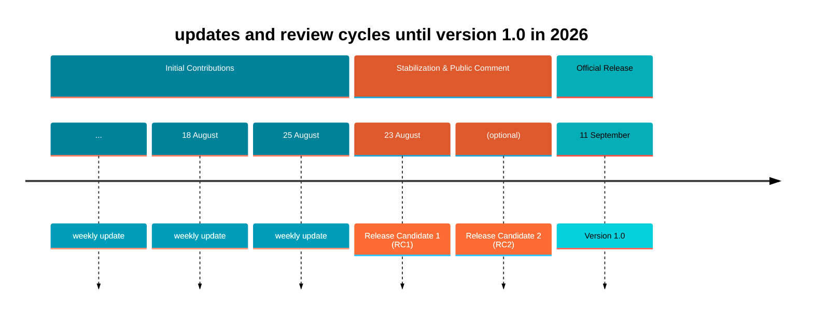
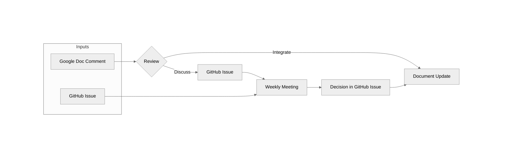

# OpenChain CRA Checklist review & contribution workflow

The OpenChain CRA Checklist is under public review. Feedback may be submitted through either the [Google Doc](https://docs.google.com/document/d/1Wog28BZ9NQhY3tN9Wc2NDml2phBDuvYu9zkXSON5z5o/edit?usp=sharing), the [GitHub repository](https://github.com/OpenChain-Project/CRA-Compliance) or the Business Operation Study Group [mailing list](https://lists.openchainproject.org/g/OpenChain-BusinessOps-Study-Group/). 

For detailed information and valid channels per release phase see details below:
- [Initial Contribution Phase - before RC1](#initial-contribution-phase---before-rc1)
- [Public Comment Phase - after RC1](#public-comment-phase---after-rc1)

## Timeline & Release schedule

**Milestones:** [Release Candidate 1 (RC1)](https://github.com/OpenChain-Project/CRA-Compliance/milestone/1) | [*Release Candidate 2 (RC2)*](https://github.com/OpenChain-Project/CRA-Compliance/milestone/2) | [Version 1.0](https://github.com/OpenChain-Project/CRA-Compliance/milestone/3)

## Review Process

### Initial Contribution Phase - before RC1

You may contribute by:

- Commenting or suggesting changes in the Google Doc (initial Phase)
- Opening a GitHub Issue
- Submitting a GitHub Pull Request

Use whichever platform you prefer.

1. Feedback from both the Google Doc and GitHub is reviewed regularly.
2. Prior to each document update, open Google Doc comments are reviewed and resolved:
   - Comments that can be addressed directly are marked for integration and incorporated into the next document revision.
   - Comments requiring further discussion, clarification, or community consensus are transferred to a GitHub Issue for tracking. A link to the new issue is added to the Google Doc comment.
3. Open GitHub Issues are reviewed and discussed during the weekly review meetings.
4. Decisions and their rationale are recorded in the corresponding GitHub Issue.
5. Agreed changes are incorporated into the checklist.
6. Once a change has been implemented or a decision has been reached, the corresponding Issue is closed.

### Public Comment Phase - after RC1
The Public Comment phase (see below) will align with the [**OpenChain Process for Public Comment Periods**](https://openchainproject.org/processes#process-public-comments). 

For the duration of the comment period, feedback is collected through:
- The [Business Operation Study Group mailing list](https://lists.openchainproject.org/g/OpenChain-BusinessOps-Study-Group/)
- The [CRA Compliance GitHub repository](https://github.com/OpenChain-Project/CRA-Compliance) in the form of GitHub Issues being created by commenters
- The [Google Doc](https://docs.google.com/document/d/1Wog28BZ9NQhY3tN9Wc2NDml2phBDuvYu9zkXSON5z5o/edit?usp=sharing)

At the conclusion of the public comment period the issues collected will be addressed by the Study Group via a scheduled call or via the mailing list.
The checklist document will generally remain unchanged during the public comment period. Should intermediate updates become necessary, they will be published through a dedicated RC release.

## Tracking Discussions and Decisions

To maintain transparency and avoid losing feedback:

- GitHub Issues are used to track topics that require discussion, decisions, or follow-up actions.
- GitHub Issues may reference related Google Doc comments, and vice versa.
- Decisions and their rationale are documented in the corresponding GitHub Issue.
- Contributors are encouraged to review existing comments and issues before creating new ones on the same topic.

## Communication

Updates on the review process, document iterations, and significant decisions will be communicated through the [**OpenChain Business Operations Study Group mailing list**.](https://lists.openchainproject.org/g/OpenChain-BusinessOps-Study-Group)

Major updates, milestones, and review announcements may also be shared on the [**OpenChain main mailing list**](https://lists.openchainproject.org/g/main) to ensure broader community visibility.

