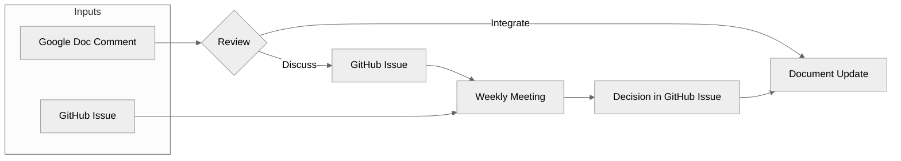
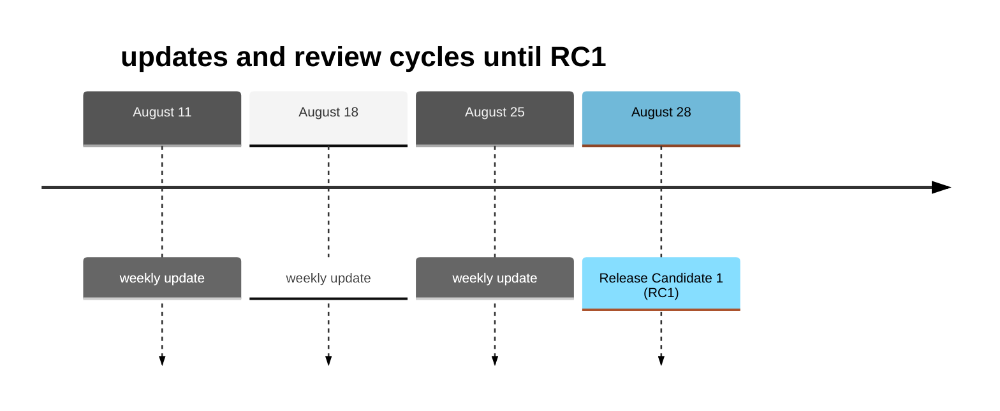

# OpenChain CRA Checklist review & contribution workflow

The OpenChain CRA Checklist is under public review. Feedback may be submitted through either the Google Doc or the GitHub repository. Both are equally valid contribution channels.

## Submitting Feedback

You may contribute by:

- Commenting or suggesting changes in the Google Doc
- Opening a GitHub Issue
- Submitting a GitHub Pull Request

Use whichever platform you prefer.

## Review Process

1. Feedback from both the Google Doc and GitHub is reviewed regularly.
2. Prior to each document update, open Google Doc comments are reviewed and resolved:
   - Comments that can be addressed directly are marked for integration and incorporated into the next document revision.
   - Comments requiring further discussion, clarification, or community consensus are transferred to a GitHub Issue for tracking. A link to the new issue is added to the Google doc comment.
3. Open GitHub Issues are reviewed and discussed during the weekly review meetings.
4. Decisions and their rationale are recorded in the corresponding GitHub Issue.
5. Agreed changes are incorporated into the checklist.
6. Once a change has been implemented or a decision has been reached, the corresponding Issue is marked as resolved.

## Tracking Discussions and Decisions

To maintain transparency and avoid losing feedback:

- GitHub Issues are used to track topics that require discussion, decisions, or follow-up actions.
- GitHub Issues may reference related Google Doc comments, and vice versa.
- Decisions and their rationale are documented in the corresponding GitHub Issue.
- Contributors are encouraged to review existing comments and issues before creating new ones on the same topic.

## Communication

Updates on the review process, document iterations, and significant decisions will be communicated through the [**OpenChain Business Operations Study Group mailing list**.](https://lists.openchainproject.org/g/OpenChain-BusinessOps-Study-Group)

Major updates, milestones, and review announcements may also be shared on the [**OpenChain main mailing list**](https://lists.openchainproject.org/g/main) to ensure broader community visibility.

## Timeline until RC1

